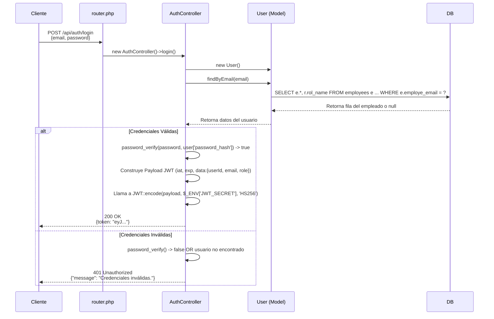

# Documentación Técnica del Flujo de Autenticación JWT

Este documento detalla el proceso técnico de autenticación y autorización implementado en el backend, utilizando JSON Web Tokens (JWT).

## Componentes Principales

1.  **`firebase/php-jwt`**: Librería de PHP para la codificación (generación) y decodificación (validación) de tokens JWT.
2.  **`.env` / `vlucas/phpdotenv`**: Archivo de configuración para almacenar variables de entorno sensibles (como `JWT_SECRET`) y la librería para cargarlas en la superglobal `$_ENV` de PHP.
3.  **`AuthController.php`**: Controlador responsable de la lógica de negocio para la autenticación, principalmente el método `login()`.
4.  **`User.php` (Modelo)**: Abstracción de la tabla `employees` de la base de datos. Provee el método `findByEmail()` para recuperar los datos de un usuario.
5.  **`AuthMiddleware.php`**: Middleware de aplicación que actúa como punto de control (gatekeeper) para las rutas protegidas.
6.  **`router.php`**: Enrutador principal (`bramus/router`) que define las rutas públicas y protegidas, y aplica el middleware.
7.  **`.htaccess`**: Archivo de configuración de Apache que, entre otras cosas, asegura que la cabecera `Authorization` sea pasada al entorno de ejecución de PHP.

---

## Flujo 1: Generación del Token (Login)

Este flujo se activa cuando un cliente realiza una petición `POST` a `/api/auth/login`.



### Proceso Detallado:

1.  **Petición del Cliente**: El cliente envía una petición `POST` a `/api/auth/login` con un `Content-Type: application/json` y un cuerpo (body) que contiene el email y la contraseña.
2.  **Enrutamiento**: `router.php` recibe la petición y, al coincidir la ruta, instancia `App\Controllers\AuthController` y ejecuta el método `login()`.
3.  **Obtención de Datos**: Dentro de `login()`, se instancia el modelo `App\Models\User` y se invoca a `findByEmail()`. Este método ejecuta una consulta SQL para encontrar al empleado y unirlo (`LEFT JOIN`) con la tabla `employees_rol` para obtener el nombre del rol.
4.  **Verificación de Contraseña**: Se utiliza la función `password_verify($password, $user['password'])`. Esta función criptográfica segura compara la contraseña en texto plano enviada por el usuario con el hash almacenado en la base de datos. Devuelve `true` solo si coinciden.
5.  **Construcción del Payload**: Si la verificación es exitosa, se crea un array asociativo (payload) que contiene:
    *   **Claims Registrados**: `iat` (Issued At - timestamp de emisión) y `exp` (Expiration Time - timestamp de expiración, calculado a partir de `JWT_EXPIRATION_HOURS`).
    *   **Claim Privado (`data`)**: Un objeto anidado con la información del usuario que se considera segura para exponer (ID, email, rol).
6.  **Codificación del JWT**: Se invoca a `Firebase\JWT\JWT::encode()`. Esta función toma el *header* (definido por defecto), el *payload*, la clave secreta (`$_ENV['JWT_SECRET']`) y el algoritmo (`HS256`) para generar la firma criptográfica y ensamblar el token final.
7.  **Respuesta**: Se envía una respuesta HTTP `200 OK` con el token JWT resultante. Si la verificación falla en el paso 4, se envía un `401 Unauthorized`.

---

## Flujo 2: Acceso a un Recurso Protegido

Este flujo se activa cuando un cliente realiza una petición a cualquier ruta protegida (ej: `GET /api/productos`).

```mermaid
sequenceDiagram
    participant Cliente
    participant Apache
    participant router.php
    participant AuthMiddleware
    participant ProductoController
    
    Cliente->>Apache: GET /api/productos <br> Header: "Authorization: Bearer eyJ..."
    Apache->>Apache: .htaccess procesa la cabecera <br> (SetEnvIf Authorization)
    Apache->>router.php: Inicia ejecución de PHP
    router.php->>AuthMiddleware: $router->before() invoca handle()
    
    AuthMiddleware->>AuthMiddleware: Lee $_SERVER['HTTP_AUTHORIZATION']
    AuthMiddleware->>AuthMiddleware: Llama a JWT::decode(token, new Key(...))
    
    alt Token Válido
        AuthMiddleware->>router.php: return; (La ejecución continúa)
        router.php->>ProductoController: new ProductoController()->index()
        ProductoController-->>Cliente: 200 OK <br> [Lista de productos]
    else Token Inválido (Firma, Expiración)
        AuthMiddleware->>AuthMiddleware: JWT::decode() lanza una Excepción
        AuthMiddleware-->>Cliente: 401 Unauthorized <br> {error: "Token expirado/inválido"}
        Note right of AuthMiddleware: La ejecución se detiene (exit())
    end
```

### Proceso Detallado:

1.  **Petición del Cliente**: El cliente envía una petición (ej: `GET /api/productos`) incluyendo la cabecera `Authorization: Bearer <token>`.
2.  **Procesamiento de Apache**: Antes de que PHP se ejecute, Apache procesa el archivo `.htaccess`. La regla `RewriteCond %{HTTP:Authorization} .` y `RewriteRule .* - [E=HTTP_AUTHORIZATION:%{HTTP:Authorization}]` es crucial: captura el contenido de la cabecera de autorización y lo reinyecta en una variable de entorno que PHP puede leer a través de `$_SERVER['HTTP_AUTHORIZATION']`. Sin esta regla, la cabecera se perdería.
3.  **Middleware Hook**: `router.php` comienza a ejecutarse. La regla global `$router->before('/api/.*', ...)` se activa. Esta invoca el método estático `App\Middleware\AuthMiddleware::handle()`.
4.  **Extracción del Token**: El middleware busca en la superglobal `$_SERVER['HTTP_AUTHORIZATION']`. Si no existe o no tiene el formato `Bearer <token>`, envía inmediatamente una respuesta `401 Unauthorized` y detiene la ejecución con `exit()`.
5.  **Decodificación y Validación del JWT**: Se invoca a `Firebase\JWT\JWT::decode()`. Esta es la operación de seguridad crítica y realiza varias validaciones en una sola llamada, protegida por un bloque `try...catch`:
    *   **Validación de Firma**: Recrea la firma usando los datos del token y la `JWT_SECRET` del servidor. Si no coincide con la firma incluida en el token, lanza una `SignatureInvalidException`. Esto previene la manipulación del token.
    *   **Validación de Expiración**: Compara el `claim` `exp` del payload con la hora actual del servidor. Si el token ha expirado, lanza una `ExpiredException`.
    *   Si cualquier otra parte del token está malformada, se lanzan otras excepciones.
6.  **Resolución del Flujo**:
    *   **Éxito**: Si `JWT::decode()` se completa sin lanzar excepciones, el método `handle()` del middleware termina su ejecución. El control vuelve al enrutador, que procede a ejecutar el controlador final (`ProductoController@index`).
    *   **Fallo**: Si se captura cualquier excepción durante la decodificación, el bloque `catch` envía una respuesta `401 Unauthorized` con un mensaje de error específico y detiene la ejecución con `exit()`, impidiendo que se llegue a ejecutar la lógica del controlador. 